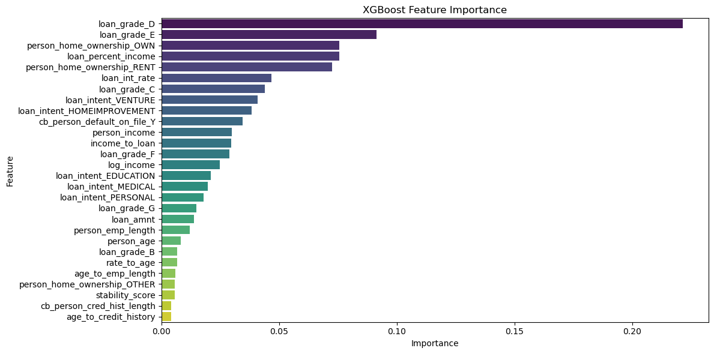

#  Loan Approval Prediction System (Based on Default Risk)


 **Live Demo:**  
[](https://aymankhan555-loan-approval-app.streamlit.app/)

---

##  Project Overview
Loan approval is a critical decision-making process for financial institutions. Incorrect approvals can lead to significant financial losses due to borrower defaults.

This project presents a **Loan Approval Prediction System** that predicts **default risk** and converts it into an approval decision:

- **Low default risk → Loan Approved ✅**
- **High default risk → Loan Not Approved ❌**

---

##  Problem Statement
Given borrower demographic and financial data, the goal is to:

- Predict **loan default risk**
- Convert it into a **loan approval decision**
- Help minimize financial loss

---

##  Project Logic

| Model Prediction | Meaning | Final Decision |
|----------------|--------|---------------|
| 0              | No Default | ✅ Loan Approved |
| 1              | Default    | ❌ Loan Not Approved |

---

##  Dataset Information

### 🔹 Target Variable
- **loan_status**: Indicates whether the borrower defaulted  
  - `1` = Default  
  - `0` = No Default  

---

### 🔹 Categorical Features
- **person_home_ownership**: Type of home ownership (e.g., RENT, OWN, MORTGAGE)  
- **loan_intent**: Purpose of the loan (e.g., EDUCATION, MEDICAL, PERSONAL, HOMEIMPROVEMENT)  
- **loan_grade**: Risk grade assigned to the loan by the lender (A to G)  
- **cb_person_default_on_file**: Indicates whether the borrower has any prior default (Y/N)  

---

### 🔹 Numerical Features
- **person_age**: Age of the borrower (in years)  
- **person_income**: Annual income of the borrower (USD)  
- **person_emp_length**: Employment length (in years)  
- **loan_amnt**: Loan amount requested (USD)  
- **loan_int_rate**: Interest rate of the loan (%)  
- **loan_percent_income**: Loan amount as a percentage of income  
- **cb_person_cred_hist_length**: Length of credit history (in years)   

---

## 🔹 Data Preprocessing
- Missing value handling  
- Duplicate removal  
- Range validation  
- Data cleaning  

---

## 🔹 Exploratory Data Analysis
- Target distribution  
- Feature distributions  
- Default rates across categories  
- Correlation analysis  

---
## 🔹 Feature Engineering
| Feature Name              | Description / Formula                                                                                                        |
| ------------------------- | ---------------------------------------------------------------------------------------------------------------------------- |
| **income_to_loan**        | Ratio of annual income to loan amount: `person_income / (loan_amnt + 1)`                                                     |
| **age_to_emp_length**     | Ratio of borrower's age to employment length: `person_age / (person_emp_length + 1)`                                         |
| **log_income**            | Log-transformed income to reduce skew: `log1p(person_income)`                                                                |
| **age_to_credit_history** | Ratio of age to credit history length: `person_age / cb_person_cred_hist_length`                                             |
| **stability_score**       | Borrower's financial stability score: `(person_emp_length * person_income) / (loan_amnt * (cb_person_cred_hist_length + 1))` |
| **rate_to_age**           | Ratio of loan interest rate to age: `loan_int_rate / person_age`                                                             |


## 🔹 Model Development
- Feature engineering  
- Models used:
  -  Random Forest  
  -  XGBoost  

---

## 🔹 Hyperparameter Tuning
- Performed using **Optuna**  
- Optimized XGBoost performance  

---

##  Model Performance
### 🔹 Model Comparison

| Model              | ROC AUC |
|--------------------|--------|
| Random Forest      | 0.938 |
| XGBoost (Baseline) | 0.953 |
| ⭐ XGBoost (Tuned) | **0.956** |

---

### 🏆 Best Model: Tuned XGBoost

The **tuned XGBoost model** achieved the best performance among all models and was selected as the final model for deployment.

---

### 🔹 Performance Metrics

- ✅ **Accuracy:** ~92%  
- ✅ **ROC-AUC:** ~0.96  
- ✅ **Recall (Default Detection):** ~84%  
- ✅ **Precision:** ~75%  

---

### 🔹Model Insights

The tuned XGBoost model performs effectively in identifying risky borrowers:

- It correctly detects **84% of actual defaults**, which is crucial for minimizing financial losses.  
- It maintains a **precision of 75%**, reducing unnecessary rejection of safe applicants.  
- Most non-default borrowers are classified correctly, contributing to an overall **accuracy of 92%**.  
- A **ROC-AUC score of 0.96** indicates strong overall classification performance.  

---


### 🔹 Feature Importance

  

---

##  Streamlit Web Application

An interactive web app built with Streamlit:

[](https://aymankhan555-loan-approval-app.streamlit.app/)
- Input applicant details  
- Get instant loan approval prediction  
- View approval probability  

---

##  App Preview


---

##  How to Run Locally

```bash
pip install -r requirements.txt
streamlit run loan_approval_app.py
```


---

## 🤝 Let's Connect

If you found this project interesting or useful:

⭐ Star the repo  
🍴 Fork it  
💬 Give feedback  

---


##  Future Improvements

- **Explore additional ML models:** LightGBM, CatBoost, and Neural Networks to improve prediction performance  
- **Advanced hyperparameter tuning:** Optimize models for better accuracy and generalization  
- **Deep learning integration:** Capture complex patterns in borrower data  
- **Enhanced UI/UX:** Improve Streamlit interface with advanced components for better user experience   
- **Automated notifications:** Integrate AI agent to send decision updates via email  
- **Model monitoring:** Track model performance in production for reliability and risk management    
