# 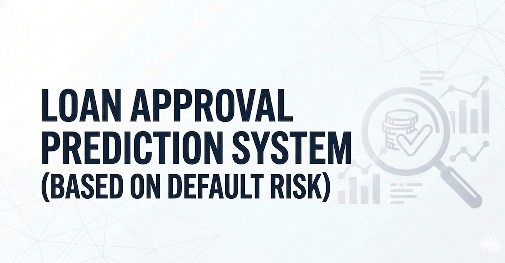


**Live Demo:**
[](https://aymankhan555-loan-approval-app.streamlit.app/)

---

## 📌 Project Overview

Loan approval is a critical decision for financial institutions. Approving a loan to someone who defaults leads to direct financial loss, while being too conservative means turning away good customers.

This project builds an end-to-end **Loan Default Prediction System** that estimates a borrower's default risk and converts it into an approval decision:

| Model Prediction | Meaning | Decision |
|---|---|---|
| 0 | No Default | ✅ Loan Approved |
| 1 | Default | ❌ Loan Not Approved |

The final model is deployed as a **Streamlit web app** where anyone can input borrower details and get an instant prediction with approval probability.

---

## 🗂️ Project Structure

```
loan-approval-prediction/
│
├── Dataset/
│   ├── credit_risk_data.csv                  # Raw dataset (91,226 rows)
│   └── credit_risk_data_cleaned.csv          # Cleaned dataset (91,046 rows)
│
├── Notebooks/
│   ├── 1_EDA_cleaning.ipynb                  # Exploration, cleaning & visualization
│   ├── 2_training.ipynb                      # Feature engineering & baseline models
│   ├── 3_tuning_optuna.ipynb                 # Hyperparameter tuning with Optuna
│   └── 4_final_evaluation.ipynb             # Final model evaluation & insights
│
├── models/
│   ├── best_model.pkl                        # Final tuned XGBoost model
│   ├── xgb_best_params.pkl                   # Best Optuna hyperparameters
│   ├── feature_columns.pkl                   # Feature schema for inference
│   └── train_test_split.pkl                  # Saved train/test splits
│
├── pics/                                     # Images for README and app
├── loan_approval_app.py                      # Streamlit web application
├── requirements.txt
└── README.md
```

---

## 📓 Notebook Workflow

Four notebooks with a clean, linear run order — no revisiting, no loops:

```
1_EDA_cleaning.ipynb
        ↓  saves → credit_risk_data_cleaned.csv

2_training.ipynb
        ↓  saves → train_test_split.pkl
        ↓  saves → feature_columns.pkl

3_tuning_optuna.ipynb
        ↓  saves → xgb_best_params.pkl

4_final_evaluation.ipynb
        ↓  saves → best_model.pkl  (used by Streamlit app)
```

> **Run order: `1 → 2 → 3 → 4`**

---

## 📊 Dataset

**91,226 loan records** with borrower demographic, financial, and loan-specific features.

### Target Variable
- **loan_status** — `1` = Default, `0` = No Default
- Class distribution: **83% No Default / 17% Default** — imbalanced, handled via `scale_pos_weight`

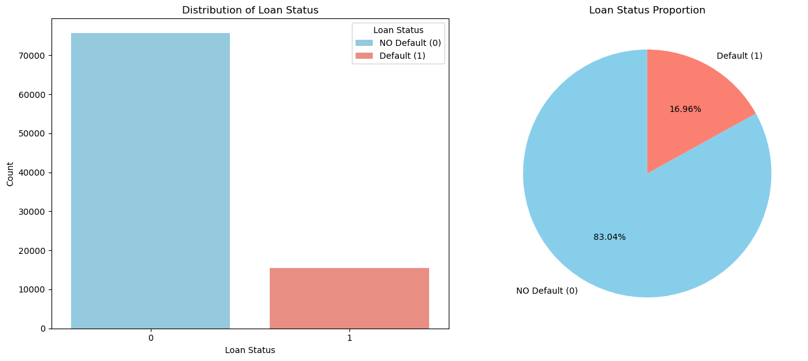

### Features

| Type | Feature | Description |
|---|---|---|
| Categorical | person_home_ownership | RENT, OWN, MORTGAGE |
| Categorical | loan_intent | EDUCATION, MEDICAL, PERSONAL, etc. |
| Categorical | loan_grade | Lender risk grade (A to G) |
| Categorical | cb_person_default_on_file | Prior default history (Y/N) |
| Numerical | person_age | Age of borrower (years) |
| Numerical | person_income | Annual income (USD) |
| Numerical | person_emp_length | Employment length (years) |
| Numerical | loan_amnt | Loan amount requested (USD) |
| Numerical | loan_int_rate | Interest rate (%) |
| Numerical | loan_percent_income | Loan amount as % of annual income |
| Numerical | cb_person_cred_hist_length | Credit history length (years) |

---

## 🔧 Data Preprocessing

### Missing Values
Median imputation was used for two columns — median chosen over mean to avoid being pulled by outliers:
- `loan_int_rate` — 3,116 missing values
- `person_emp_length` — 895 missing values

### Duplicates
165 duplicate rows found and removed (checked excluding the `id` column to avoid false negatives).

### Range Validation
A custom range check flagged impossible values:

| Column | Issue Found | Action |
|---|---|---|
| person_age | Ages 123, 144, 94, 84 | Removed — impossible or outside borrowing demographic |
| person_emp_length | Employment length 123 years | Removed — clearly a data entry error |
| person_income | Values up to $6M | Retained — controlled via `log_income` transformation |

Only **14 rows removed** out of 91,060 — less than 0.02% of the data.

### Final cleaned dataset: **91,046 rows, 12 columns**

---

## 🔬 Exploratory Data Analysis


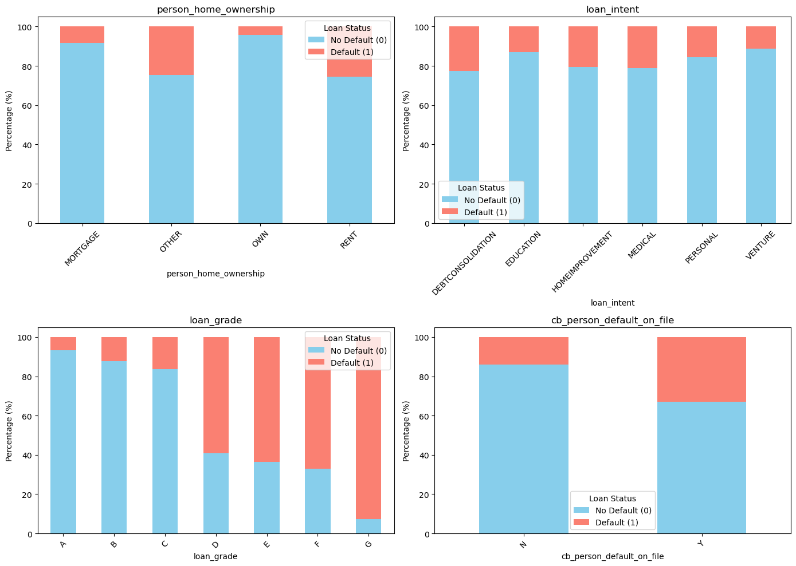

**What the categories tell us:**

| Category | Low Risk ✅ | Moderate ⚠️ | High Risk 🚨 |
|---|---|---|---|
| 🏠 Home Ownership | OWN | MORTGAGE | RENT |
| 🎯 Loan Purpose | Education / Venture | Home Improvement | Medical / Debt Consolidation |
| 📉 Loan Grade | A & B (Prime) | C (Mid-tier) | D, E, F, G (Subprime) |
| 🚩 Default History | No (N) | — | Yes (Y) — Critical Flag |

Borrowers with higher loan burden, higher interest rates, lower credit
grades, and a previous default are much more likely to default. On the
other hand, people with stable income, longer credit history, and home
ownership tend to be safer bets.

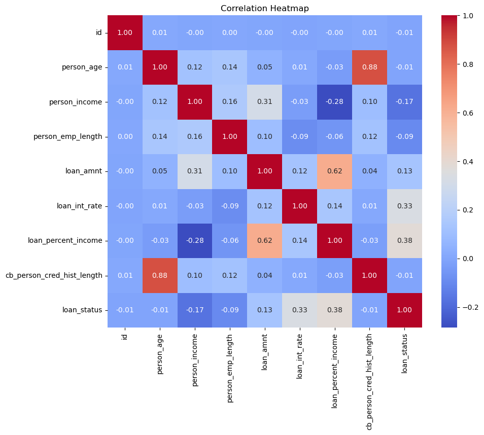
**What the numbers tell us:**

| Feature | Correlation | What it means |
|---|---|---|
| loan_percent_income → loan_status | +0.38 | Higher loan burden increases default risk |
| loan_int_rate → loan_status | +0.33 | Higher interest rates lead to more defaults |
| person_income → loan_status | -0.17 | Higher income slightly reduces default risk |
| person_age, emp_length, cred_hist → loan_status | ~0 | Weak individual impact |
| person_age ↔ cred_hist_length | +0.88 | Strongly correlated — addressed via feature engineering |


---

## ⚙️ Feature Engineering

Six new features created to capture domain-specific financial patterns:

| Feature | Formula | What it captures |
|---|---|---|
| income_to_loan | `person_income / (loan_amnt + 1)` | Repayment capacity |
| age_to_emp_length | `person_age / (person_emp_length + 1)` | Career stability relative to age |
| log_income | `log1p(person_income)` | Reduces income skewness |
| age_to_credit_history | `person_age / cb_person_cred_hist_length` | Credit experience relative to age |
| stability_score | `(emp_length × income) / (loan_amnt × (cred_hist + 1))` | Combined financial stability |
| rate_to_age | `loan_int_rate / person_age` | Risk-adjusted interest burden |

---

## 🤖 Model Development

### Why These Models

Three baseline models were compared following a principled complexity ladder — starting simple and moving to more complex:

```
Logistic Regression   →  simple linear baseline, fully interpretable
         ↓
Random Forest         →  non-linear ensemble, handles feature interactions
         ↓
XGBoost Baseline      →  gradient boosting, stronger sequential learner
         ↓
XGBoost Tuned ⭐      →  Optuna-optimized, final production model
```

### Scaling Decision

Tree-based models (Random Forest, XGBoost) make decisions based on split thresholds — scaling features doesn't change where the best split is. Only Logistic Regression needs scaling:

| Model | Scaled | Reason |
|---|---|---|
| Logistic Regression | ✅ via Pipeline | Sensitive to feature magnitude |
| Random Forest | ❌ | Tree-based — scale invariant |
| XGBoost | ❌ | Tree-based — scale invariant |

A `Pipeline(StandardScaler → LogisticRegression)` was used to ensure scaling only fits on training folds during cross-validation — preventing data leakage.

### Class Imbalance Handling

All models handle the 83/17 class imbalance consistently:

| Model | Parameter |
|---|---|
| Logistic Regression | `class_weight='balanced'` |
| Random Forest | `class_weight='balanced'` |
| XGBoost | `scale_pos_weight = 4.88` |

### Baseline Results (5-Fold Stratified CV)

| Model | CV Mean AUC | Std |
|---|---|---|
| Logistic Regression | 0.8951 | 0.0042 |
| Random Forest | 0.9390 | 0.0022 |
| XGBoost Baseline | 0.9525 | 0.0010 |

XGBoost achieved the highest AUC with the lowest variance — selected for tuning.

---

## 🔍 Hyperparameter Tuning

Tuning performed in a dedicated notebook using **Optuna with TPE Sampler** over **150 trials**, optimizing ROC-AUC via Stratified 5-Fold CV.

Fixed parameters (`scale_pos_weight`, `random_state`, `eval_metric`) were kept outside the search space so `study.best_params` only contains tunable parameters — avoiding duplication when building the final model.

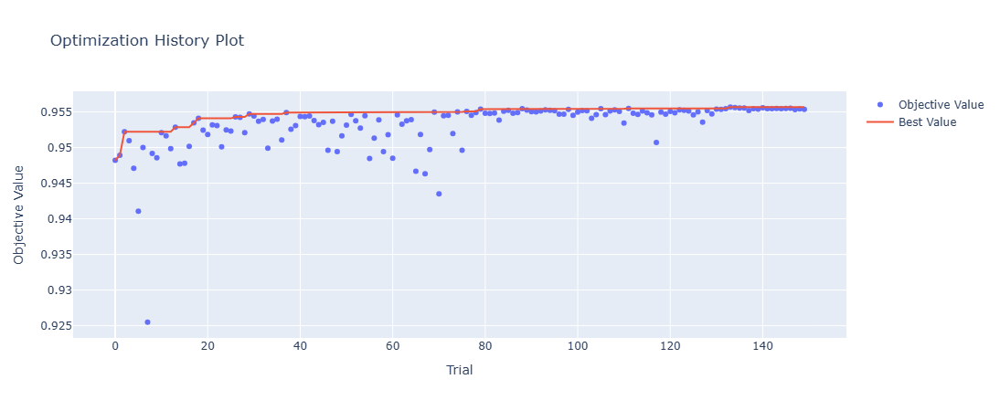

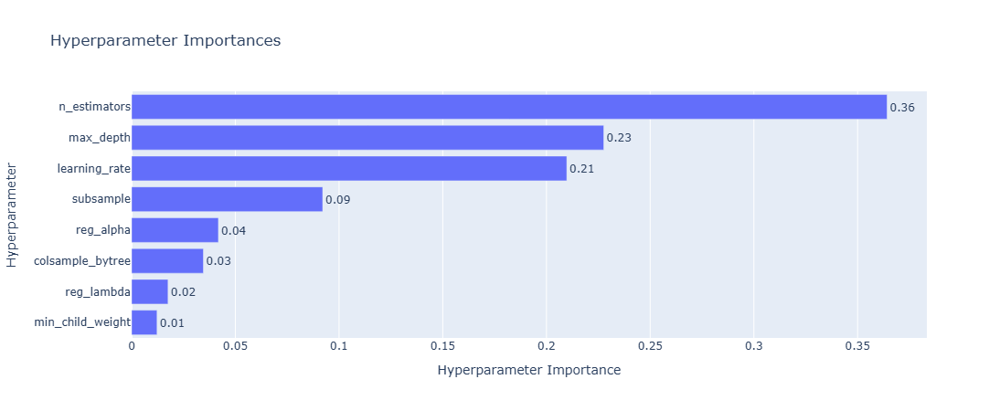

### Best Parameters

| Parameter | Search Range | Best Value |
|---|---|---|
| n_estimators | 100 – 1000 | **943** |
| max_depth | 3 – 15 | **5** |
| learning_rate | 0.01 – 0.30 (log scale) | **0.0466** |
| subsample | 0.50 – 1.00 | **0.9649** |
| colsample_bytree | 0.50 – 1.00 | **0.9958** |
| min_child_weight | 1 – 10 | **9** |
| reg_lambda | 0.00 – 5.00 | **1.1127** |
| reg_alpha | 0.00 – 5.00 | **0.1698** |

---

## 🏆 Final Model Performance

**Test set evaluated once — exclusively for the final tuned model.**

| Metric | Score |
|---|---|
| ROC-AUC | **0.9572** |
| Accuracy | **93%** |
| Recall (Default) | **83%** |
| Precision (Default) | **75%** |
| F1 (Default) | **0.79** |

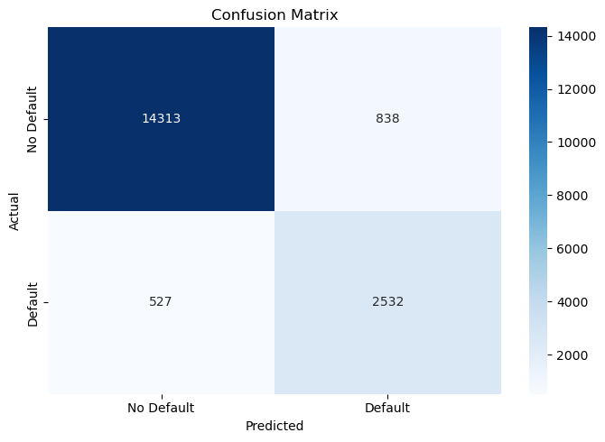

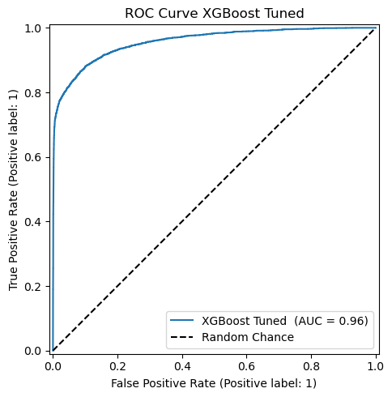

### What the Numbers Mean

The model correctly catches **83% of real defaulters** — the most business-critical metric. Missing a real defaulter costs the bank far more than turning away a safe applicant. Precision of 75% means 1 in 4 flagged defaulters is actually safe — an acceptable tradeoff for a conservative lending system.

### Full Model Journey

| Model | CV Mean AUC | Test ROC-AUC | Handles Imbalance |
|---|---|---|---|
| Logistic Regression | 0.8951 | — | ✅ class_weight=balanced |
| Random Forest | 0.9390 | — | ✅ class_weight=balanced |
| XGBoost Baseline | 0.9525 | — | ✅ scale_pos_weight |
| ⭐ XGBoost Tuned | — | **0.9572** | ✅ scale_pos_weight |

Baseline models were selected using CV AUC only — the test set was reserved
exclusively for the final tuned model to ensure an unbiased evaluation.

Baseline models were compared using CV AUC only — the test set was reserved exclusively for the final model to ensure an unbiased evaluation.

---

## 📉 Threshold Analysis

The default threshold is 0.5. In credit risk, missing a defaulter is more costly than a false rejection — so the threshold can be lowered to catch more defaulters at the cost of more false alarms. This chart lets a business team pick their own cutoff based on risk appetite.

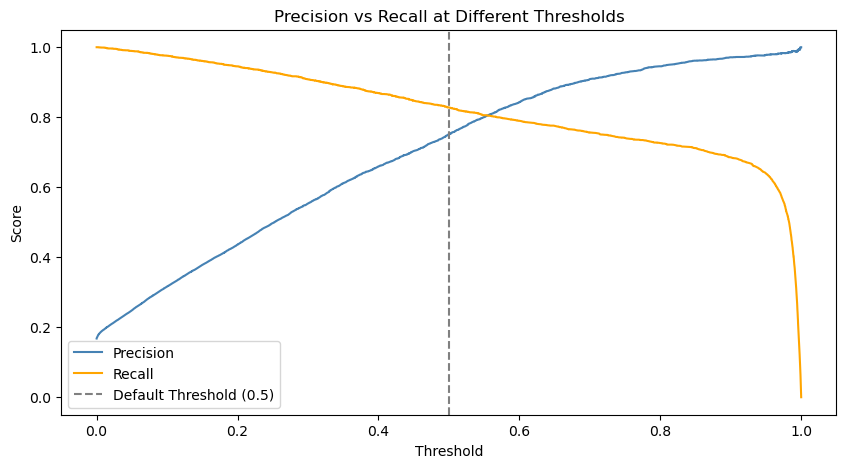

At threshold 0.5: **Precision = 0.75, Recall = 0.83** — a good balance for a general-purpose lending model.

---

## 📈 Feature Importance


---

## 🌐 Streamlit Web Application

[](https://aymankhan555-loan-approval-app.streamlit.app/)

An interactive app where users input borrower details and get an instant loan decision with default probability.

## App Preview

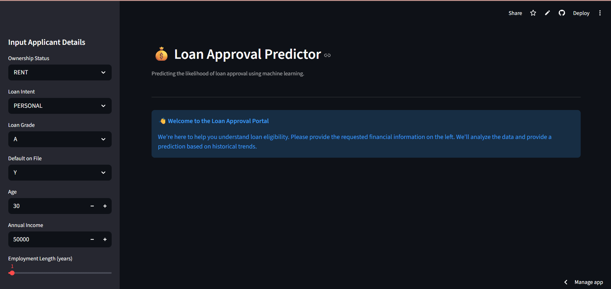
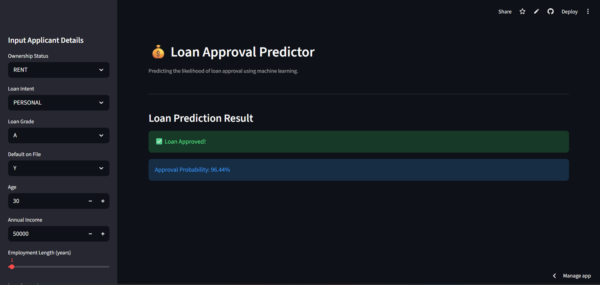
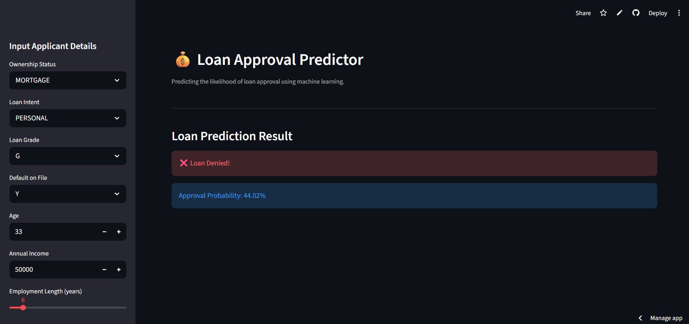

---

## 🚀 How to Run Locally

**1. Clone the repository**
```bash
git clone https://github.com/aymankhan555/loan-approval-prediction.git
cd loan-approval-prediction
```

**2. Create a virtual environment**
```bash
python -m venv venv
source venv/bin/activate        # Windows: venv\Scripts\activate
pip install -r requirements.txt
```

**3. Run notebooks in order**
```
1_EDA_cleaning → 2_training → 3_tuning_optuna → 4_final_evaluation
```

**4. Launch the app**
```bash
streamlit run loan_approval_app.py
```

> The cleaned dataset and model files are included in the repo — skip to step 4 to run the app directly.

---

## 🛠️ Tech Stack

| Tool | Purpose |
|---|---|
| Python 3.13 | Core language |
| Pandas / NumPy | Data manipulation |
| Matplotlib / Seaborn | Visualization |
| Scikit-Learn | Pipelines, CV, LR, RF |
| XGBoost | Final prediction model |
| Optuna | Hyperparameter tuning |
| Joblib | Model serialization |
| Streamlit | Web application |

---

## 🔮 Future Improvements

- **Threshold optimization** — use the precision-recall analysis to set a business-specific cutoff rather than the default 0.5
- **SHAP values** — add per-prediction explainability to show which features drove each individual loan decision
- **LightGBM / CatBoost** — benchmark against other gradient boosting frameworks
- **FastAPI endpoint** — wrap the model in a REST API for integration with external banking systems
- **Model monitoring** — track prediction drift in production to know when retraining is needed

---

## 🤝 Let's Connect

If you found this project useful:

- ⭐ Star the repo
- 🍴 Fork it
- 💬 Open an issue or give feedback
